# Identifying Customers Likely to Churn for a Telecommunications Provider

## Description of the Project

The dataset we will be using is available on [Kaggle](https://www.kaggle.com/c/customer-churn-prediction-2020/overview). The file has not been included as a sign-up is needed to access it.

## Project Goal

Our aim is to explore and analyse the data to identify customers who are likely to churn.

## An Overview of the Data

- The dataset has 20 columns, with 9 columns of interest.
    - ```state```: US state of residence
    - ```area_code```: Area code
    - ```voice_mail_plan```: Voicemail plan yes/no
    - ```number_vmail_messages```: Number of voicemail messages
    - ```total_day_minutes```: Total minutes of day calls
    - ```today_day_calls```: Total number of day calls
    - ```total_day_charge```: Total charge of day calls
    - ```number_customer_service_calls```: Numbers of customer service calls
    - ```churn```: Whether the customer has churned or not

## Cleaning and Preparing the Data

- ```area_code```: Shortened string to just three-digit code
- ```voice_mail_plan```: Yes/No converted to 1/0
- ```churn```: Yes/No coverted to 1/0


## Churn rate

- The churn rate is calculated as (number of customers who churned/total number of customers) * 100.
- Of 4250 customers, 598 have churned. This gives a rate of **14.07%**.

## Descriptive Statistics

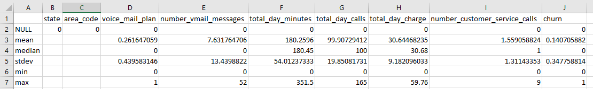

- An overview of the statistics shows the following:
    - There is large variation in the amount of minutes spent on the phone during the day (st.dev: 54.01).
    - There is large variation in the amount of calls made during the day (st.dev: 19.85).
    - The mean and median for most variables is similar, except for the number of voicemail messages (mean: 7.63; median: 0). This suggests a massive skew in the data.

## Who churns?

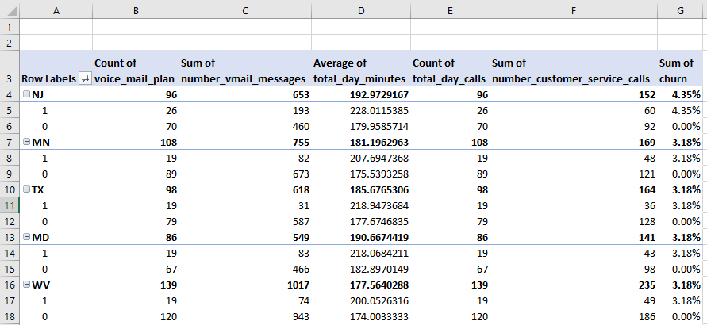

- A PivotTable was created to determine the states accounting for the largest percentage in churn.
- NJ, MN, TX, MD and WV.
- In these states, the percentage of customers without a voicemail plan is lower among those that churn than those that don't (e.g, TX; 25% vs 5%).

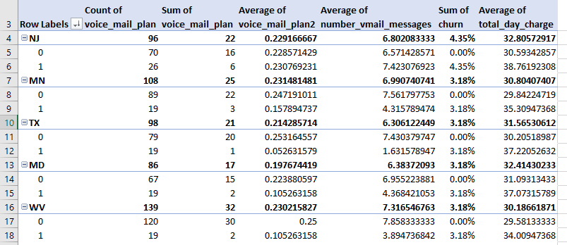

- The average total day charge is also greater among those that have churned.
- The average number of voicemail messages is also lower among those that have churned.


- 86.29% of customers who churned did not have a voicemail plan.
- Customers who churned were charged more on average for day usage.
- Customers who churned had an average of 4.30 voicemails, vs. 8.18 for those that did not churn (likely due to the lack of voicemail being setup).

## Histograms

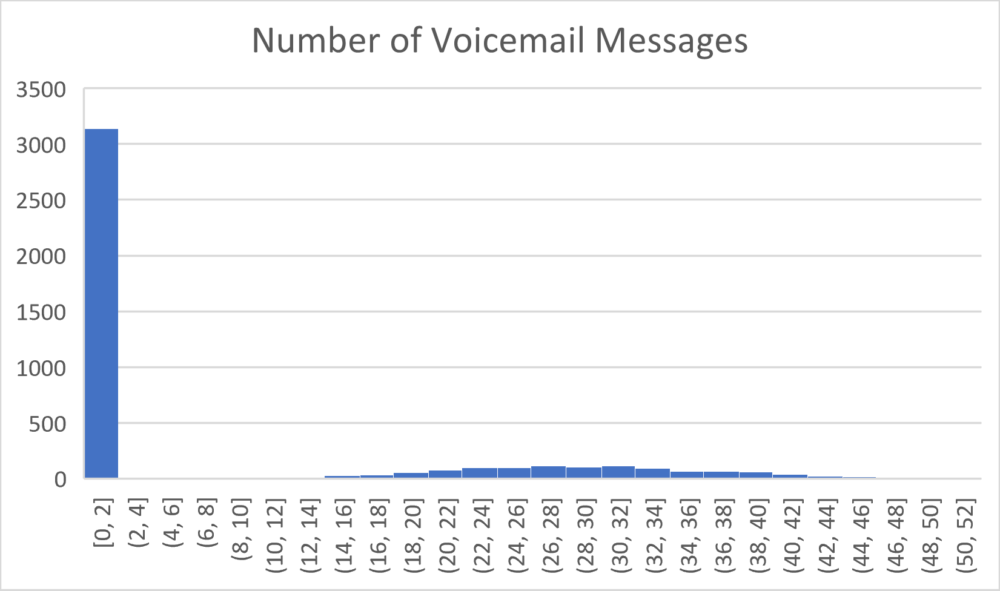
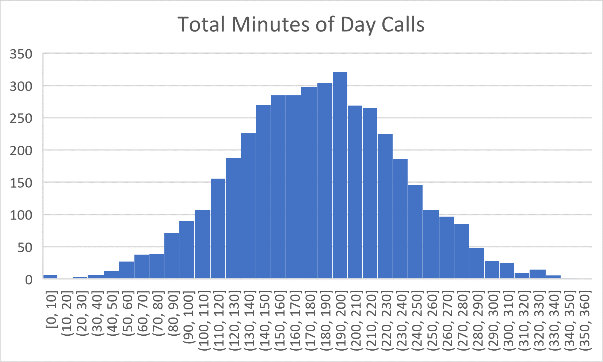
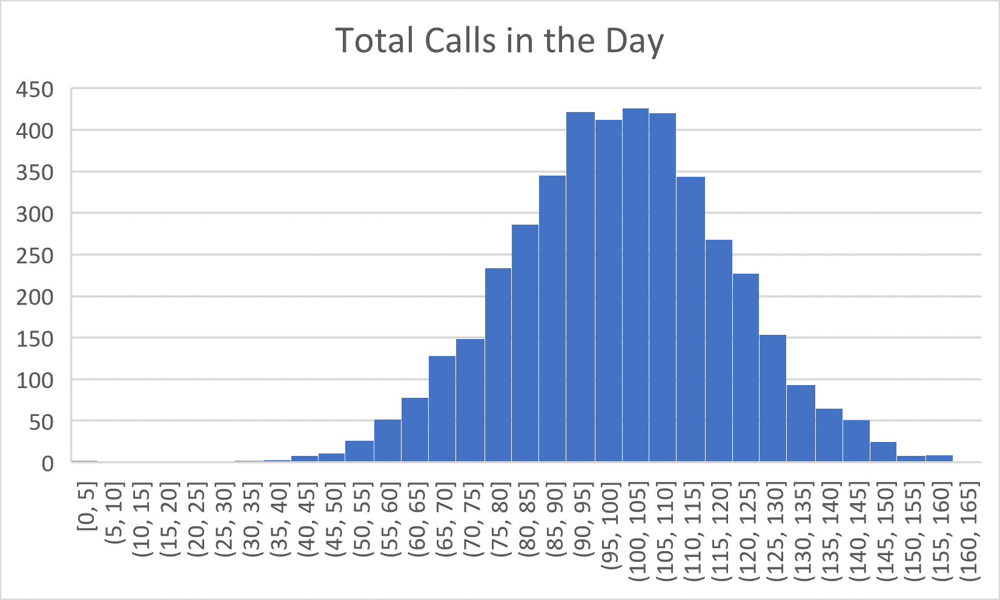
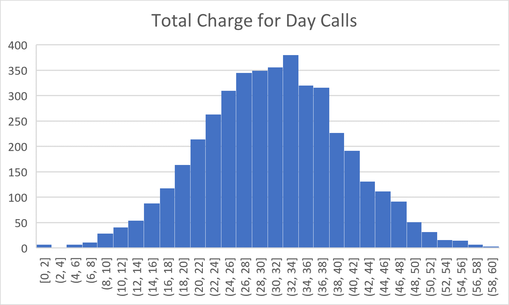
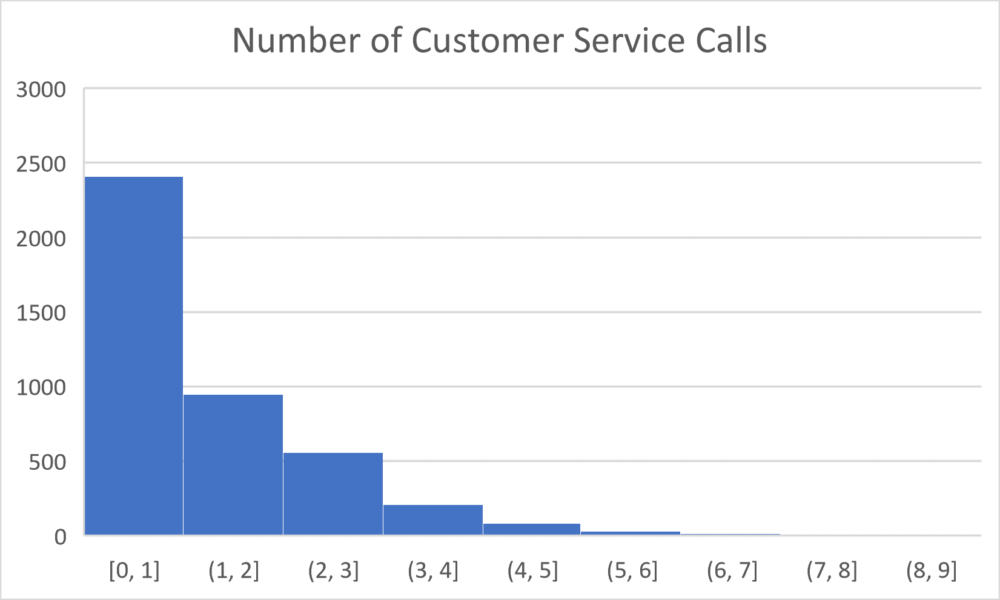

## Comparison


- Customers that churned had significantly fewer voicemail messages.

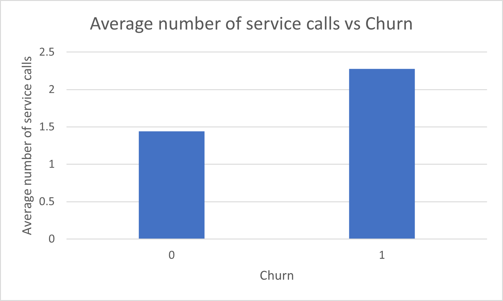

- Customers that churned had more service calls.

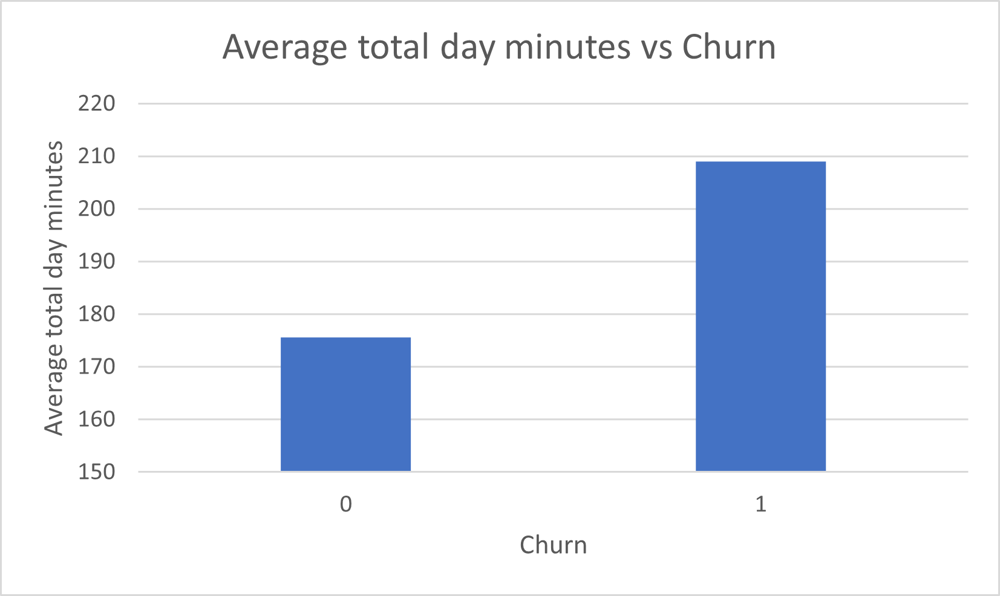

- Customers that churned spent more minutes on the phone during the day.

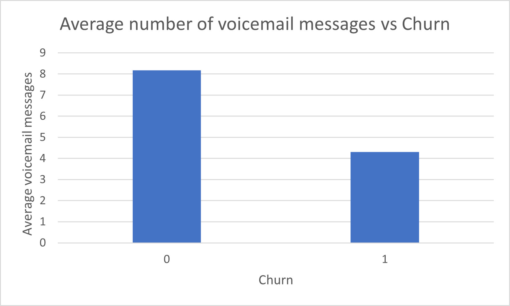

- Customers that churned had approximately half the number of voicemail messages.

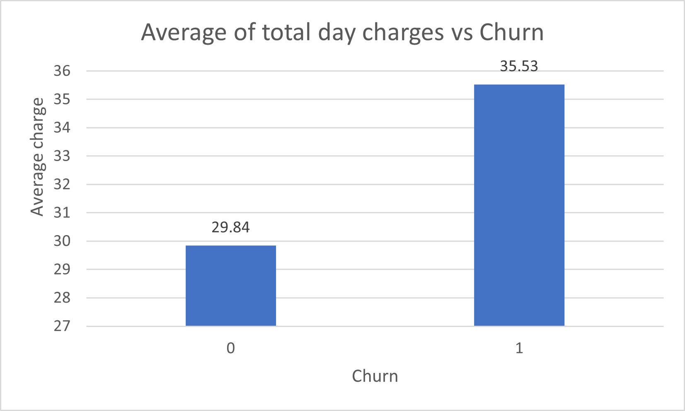

- Customers that churned were charged more.

## Two-sample t-tests

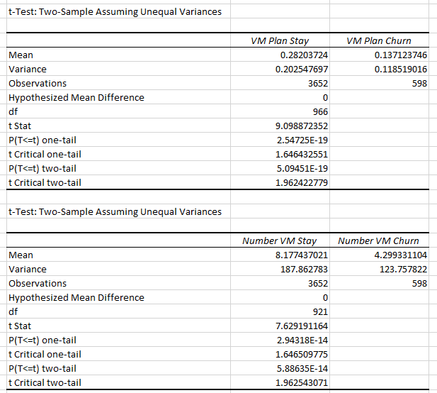
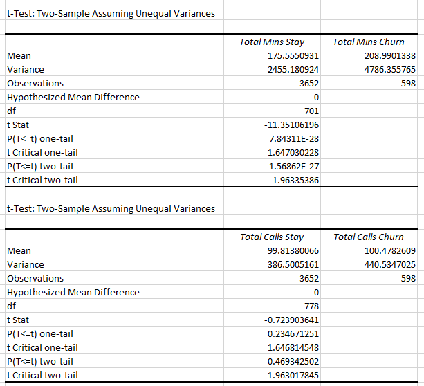
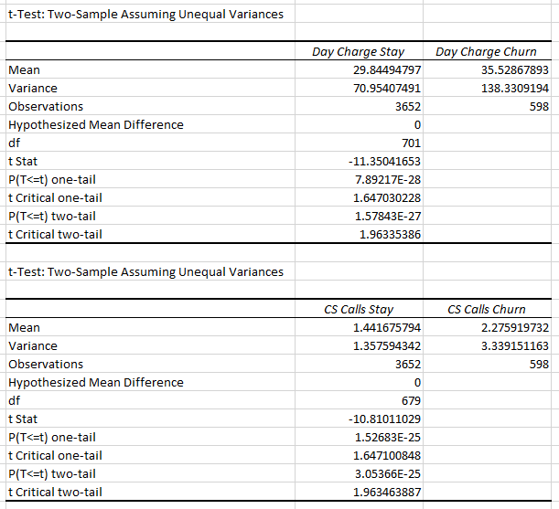

- Two sample t-tests also support the conclusions made.
- Since the p-value is much smaller than 0.05 in all but one test, we reject each null hypothesis and conclude that there is a statistically significant mean difference between the groups for each variable.
- Since the p-value is not smaller than 0.05 (p-value = 0.47) when testing the total day calls, we do not reject the null hypothesis at the 5% significance level and conclude that there is no statistically significant difference in the total day calls between each group.