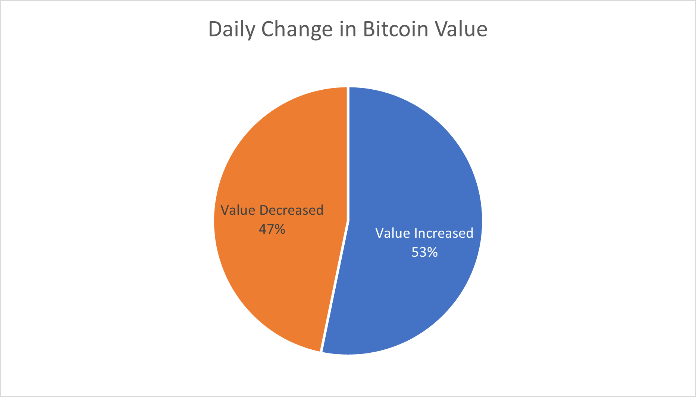
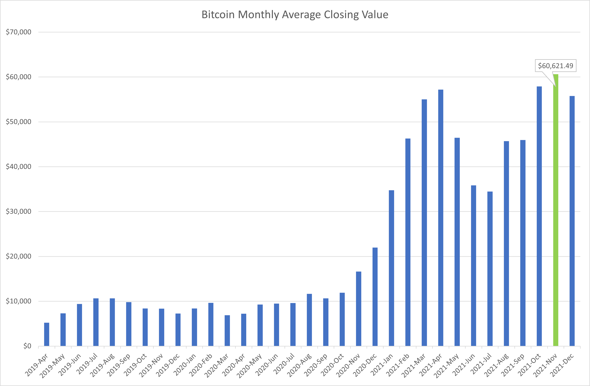
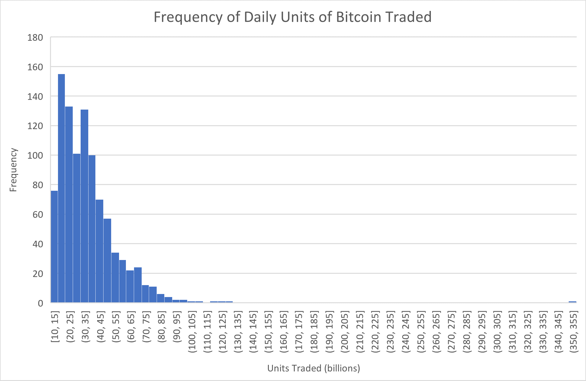
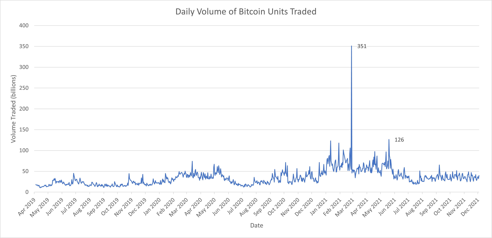
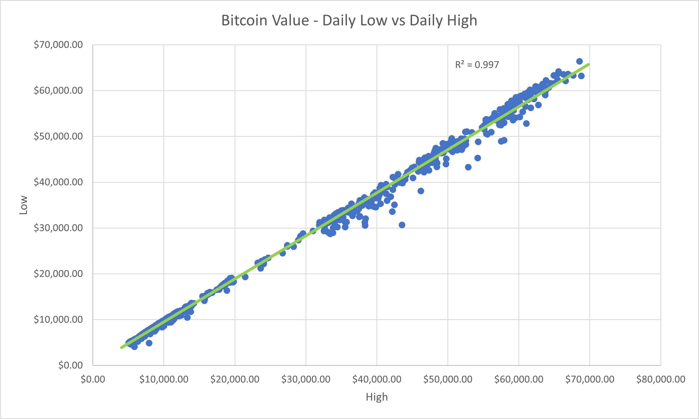
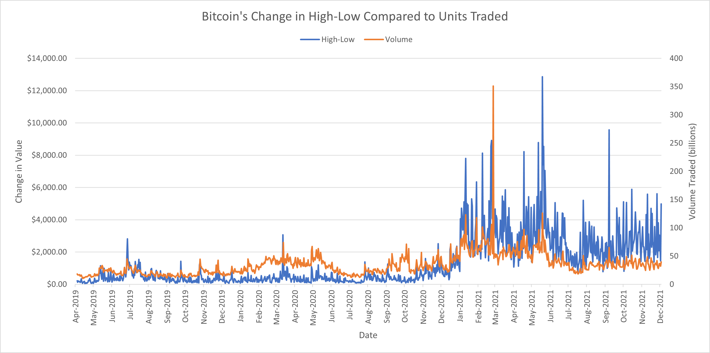

# Visualizing the Answer to Stock Questions Using Spreadsheet Charts

## Description of the Project

The dataset we will be using is available on [Kaggle](https://www.kaggle.com/datasets/mushfirat/106-cryptocurrency-historical-data?select=Bitcoin.csv). This data is taken from coinmarketcap and it is free to use the data.

## Project Goal

Our aim is to visualise and analyse the data to answer the following questions:

1. How often did Bitcoin increase in value on any given day?
2. How do the average monthly closing values compare to one another over the year?
3. How frequently are smaller volumes of units traded daily compared to larger ones?
4. Were there times during the year when trading was high/low, and do you see any seasonal patterns in trading?
5. Is there a relationship between the daily ```High``` and ```Low``` values for Bitcoin?
6. Do large differences in the daily High and Low coincide with higher or lower trading volumes?

## An Overview of the Data

- The dataset has a header row and 975 rows with data entires. 
- The dataset has 8 main columns.
    - ```Date``` Ranging from 2019/04/04 to 2021/12/03
    - ```Open```
    - ```High```
    - ```Low```
    - ```Close```
    - ```Volume```
    - ```Market Cap```
    - ```Circulating Supply```

## Question 1: How often did Bitcoin increase in value on any given day?



- On any given day, the value of Bitcoin is more slightly likely to increase.

## Question 2: How do the average monthly closing values compare to one another over the year?



- The average closing value for each month stays relatively similar until November 2020, where it begins to exponentially increase until April 2021, where it then declines again. 
- November 2021 had the highest average closing value for each day.

## Question 3: How frequently are smaller volumes of units traded daily compared to larger ones?



- The median number of units traded per day is approximately 31 billion.
- One trading day saw over 350 billion units traded (February 26 2021). 

## Question 4: Were there times during the year when trading was high/low, and do you see any seasonal patterns in trading?



- The largest number of units traded was on February 26 2021. 
- The smallest number of units traded was on April 14th 2019.
- There does not appear to be any seasonal pattern in trading.
- Most days see between 20 billion and 100 billion units traded.

## Questions 5: Is there a relationship between the daily High and Low values for Bitcoin?



- There is a strong linear relationship between the daily high and daily low.
- As the R-squared value is very close to 1, almost all the variability in one variable can be explained by the variability in the other.

## Question 6: Do large differences in the daily High and Low coincide with higher or lower trading volumes?



- There does appear to be a small relationship between the daily High-Lower difference and trading volume. 
- When there is a larger High-Low difference, there are more units traded.