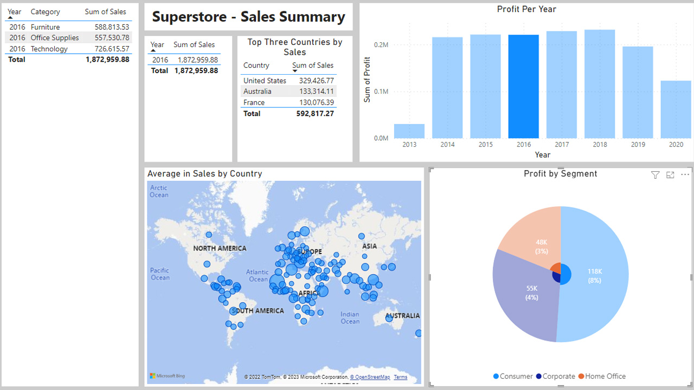

# Modelling and Visualising Superstore Sales Data

## Description of the Project

The dataset contains sales data for office supplies. It is arranged in thirteen columns:
- `Order ID`
- `Date`
- `Customer Name`
- `Segment`
- `Country`
- `Market`
- `Product Id`
- `Category`
- `Sub-Category`
- `Product Name`
- `Sales`
- `Quantity`
- `Profit`

By visualising and analysing the data, we can determine the most profitable categories of supplies, biggest markets, and historical sales trends.

## Project Goal

Our aim is to visualise the data to answer the following questions:

1. What were the total sales for the company?
2. Which market generated the most sales on average?
3. What were the profits by segment? Which segment has the most profit?

We want answers for the entire history of the company, and 2016 specifically.

## Cleaning and Preparing the Data

The data was imported into Power BI and transformed.

- Columns do not have appropriate names. The names are in row two. First row was removed so that the headers could be promoted from row one.
- The `Date` column had `/` replaced with `-` for consistency.
- The `Date` column type was changed from Text to Date.
- The `Sales` column type was changed from Text to Decimal Number.
- The `Quantity` column type was changed from Text to Whole Number.
- The `Profit` column type was changed from Text to Decimal Number.
- A `Year` column was added using the following DAX function:
    - `Year = YEAR('superstore data'[Ordered Date])`
- A `Total Sales` measure was created using the following DAX function:
    - `Total Sales = SUM('superstore data'[Sales])`
- An `Avg Sales` measure was creating using the following DAX function:
    - `Avg Sales = AVERAGE('superstore data'[Sales])`
- A `Net Profit 2016` measure was created using the following DAX function:
    - `Net Profit 2016 = CALCULATE(
          SUM('superstore data'[Profit]),
          'superstore data'[Year] = 2016
          )`
- While these would be enough to answer the project questions, a more thorough report will allow similar analyses of other years.
- The following visuals were created:
    - Table - Columns: `Year`, `Category`, `Sum of Sales`
    - Table - Columns: `Year`, `Sum of Sales`
    - Table - Columns: `Country`, `Sum of Sales`
    - Map - Location: `Country` - Bubble Size: `Avg Sales`
    - Clustered Column Chart - X-axis: `Year` - Y-axis: `Sum of Profit`
    - Pie Chart - Legend: `Segment` - Values: `Sum of Profit`

## Data Visualisation

Power BI reports cannot be shared publicly. The following images demonstrate the use of the dashboard to achieve the project goals.

## Question 1: What were the total sales for the company?

- The total sales for the company was $12,642,501.91.

- In 2016, the total sales for the company was $1,872,959.88.

## Question 2: Which market generated the most sales on average?

- The top three countries by sales were United States ($2,297,200.86), Australia ($925,235.85) and France ($858,931.08).

- In 2016, the top three countries by sales were United States ($329,426.77), Australia ($133,314.11) and France ($130,076.39).

## Question 3: What were the profits by segment? Which segment has the most profit?

Overall:
- Home Office: $277,009.18
- Corporate: $441,208.33
- Consumer: $749,239.78

In 2016:
- Home Office: $48,220.77
- Corporate: $54,822.45
- Consumer: $117,846.39