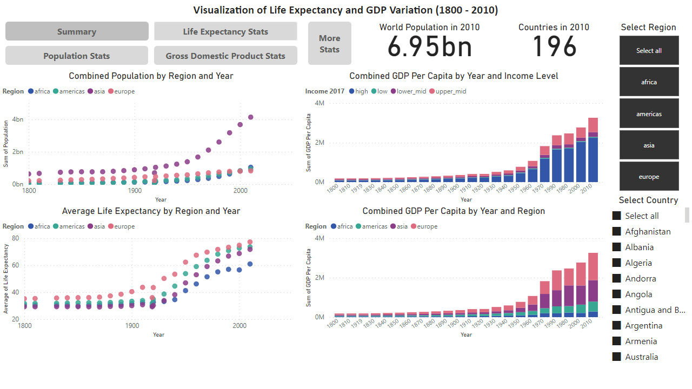
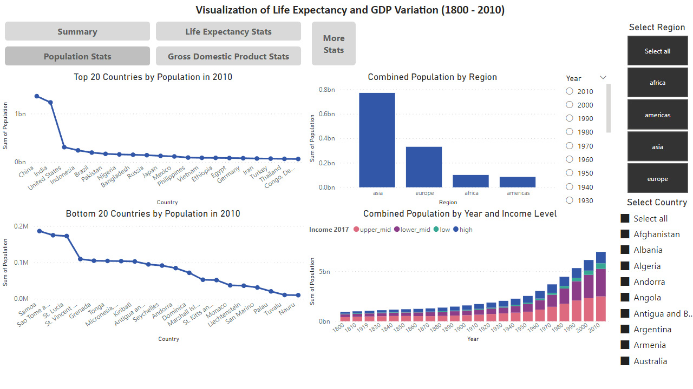
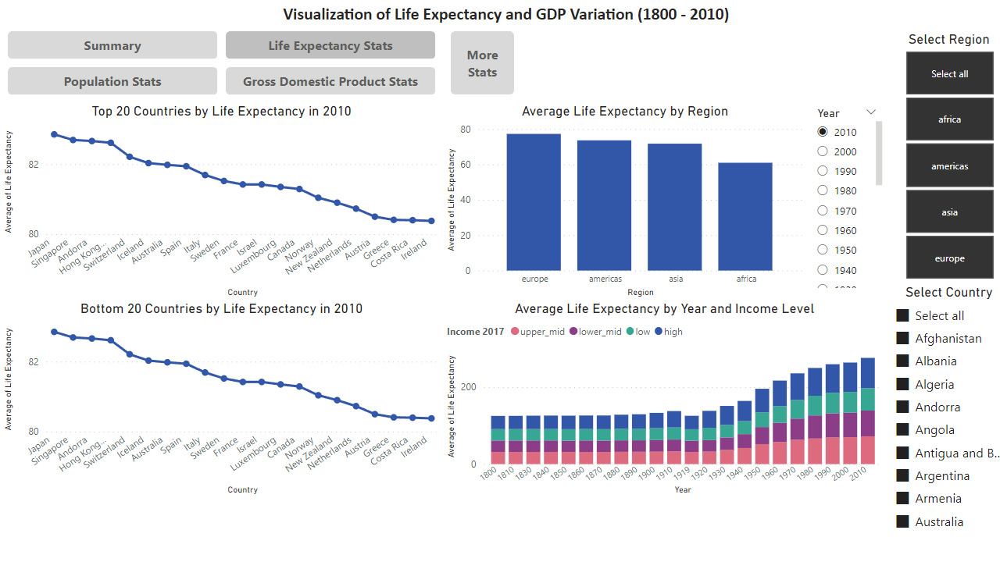
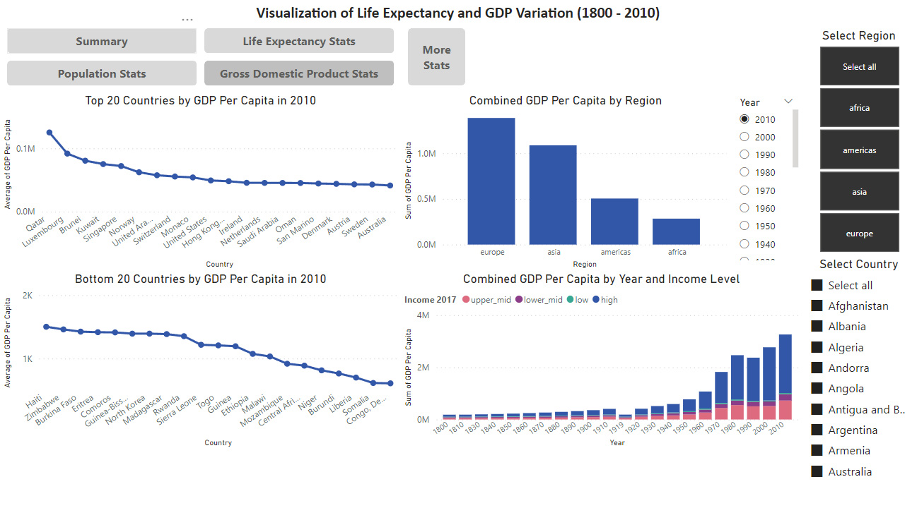
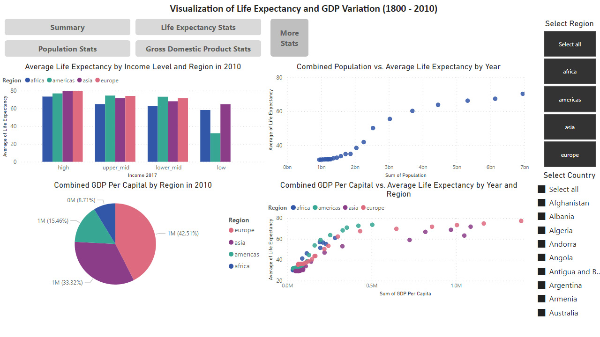

# Visualising Life Expectancy and GDP Variation Over Time

## Description of the Project

The Gapminder dataset combines data from multiple sources into coherent time-series information about life expectancy over time for countries and regions around the world. 

The dataset is arranged in twelve columns:
- `Column1`
- `name`
- `year`
- `population`
- `gdp_percap`
- `life_exp`
- `region`
- `oecd`
- `g77`
- `lat`
- `long`
- `income_2017`

By visualising and analysing the data, we can determine trends in life expectancy, population and GDP between regions, countries and income classes.

## Cleaning and Preparing the Data

The data was imported into Power BI and transformed.

- Upon loading the data, many errors occured.
- The `life_exp` column had `NA` values and was Text type. Its type was changed to Decimal Number and `NA` results replaced with a null value.
- The `year` column had errors that were replaced with `1919`.
- The `name` column was renamed `Country`.
- The `life_exp` column was renamed `Life Expectancy`.
- The `g77` column was removed.
- Columns were renamed to have capitalisation.

## Data Visualisation

Power BI reports cannot be shared publicly. The following images demonstrate the use of the dashboard to achieve the project goals.

